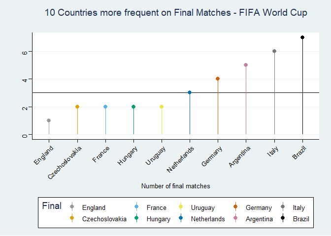

# Data Visualization Project 01

## load libraries

> Now we will use R to get and manipulate the csv file in order to perform data visualization. We will start loading the tidyverse package, storing the csv in a variable, create a color palette that  will be used in the next steps and change all ‘Germany FR’ names to simply Germany.


```r
library(tidyverse)
```

```
## -- Attaching packages --------------------------------------------------------------------------------------- tidyverse 1.3.0 --
```

```
## v ggplot2 3.3.2     v purrr   0.3.4
## v tibble  3.0.3     v dplyr   1.0.2
## v tidyr   1.1.2     v stringr 1.4.0
## v readr   1.3.1     v forcats 0.5.0
```

```
## Warning: package 'ggplot2' was built under R version 4.0.3
```

```
## -- Conflicts ------------------------------------------------------------------------------------------ tidyverse_conflicts() --
## x dplyr::filter() masks stats::filter()
## x dplyr::lag()    masks stats::lag()
```

```r
library(ggthemes)
```

```
## Warning: package 'ggthemes' was built under R version 4.0.3
```
## load csv and create global variables


```r
world_cup_matches <- read_delim('../data/WorldCupMatches.csv', ';')
```

```
## Parsed with column specification:
## cols(
##   .default = col_character(),
##   Year = col_double(),
##   Home_Team_Goals = col_double(),
##   Away_Team_Goals = col_double(),
##   Attendance = col_double(),
##   Half_time_Home_Goals = col_double(),
##   Half_time_Away_Goals = col_double(),
##   RoundID = col_double(),
##   MatchID = col_double()
## )
```

```
## See spec(...) for full column specifications.
```

```r
cb_palette <- c("#999999", "#E69F00", "#56B4E9", "#009E73", "#F0E442", "#0072B2", "#D55E00", "#CC79A7", "#777777", "#000000")
world_cup_matches$Home_Team_Name[world_cup_matches$Home_Team_Name == 'Germany FR'] <- 'Germany'
world_cup_matches$Away_Team_Name[world_cup_matches$Away_Team_Name == 'Germany FR'] <- 'Germany'
```

## create function to get match winner
> The next steps will focus on create functions that will be used to identify the match winner and loser in our RStudio environment and will be helpful for us to perform the visualizations for this project.


```r
draw <- function(win_conditions, home_name, away_name) {
  home_penalty <- 0
  away_penalty <- 0
  regex_match <- str_match(win_conditions, regex('(\\d\\d?) - (\\d\\d?)'))
  is_country_name <- str_match(win_conditions, regex('(\\w+) win'))
  home_penalty <- as.integer(regex_match[,2])
  away_penalty <- as.integer(regex_match[,3])
  if(is.character(is_country_name[,2])) {
    return(is_country_name[,2])
  }
  return(if_else(home_penalty > away_penalty, home_name, away_name))
}
not_draw <- function(home_goals, away_goals, home_name, away_name) {
  return(if_else(home_goals > away_goals, home_name, away_name))
}
matchWinner <- function(home_goals, away_goals, home_name, away_name, win_conditions) {
  
  name <- ''
  if(as.integer(home_goals) != as.integer(away_goals)) {
    name <- not_draw(home_goals, away_goals, home_name, away_name)
  }
  if(as.integer(home_goals) == as.integer(away_goals)) {
   name <- draw(win_conditions, home_name, away_name)
  }
  return(name)
  
}
```

## create function to get match loser


```r
draw_loser <- function(win_conditions, home_name, away_name) {
  home_penalty <- 0
  away_penalty <- 0
  regex_match <- str_match(win_conditions, regex('(\\d\\d?) - (\\d\\d?)'))
  home_penalty <- as.integer(regex_match[,2])
  away_penalty <- as.integer(regex_match[,3])
  return(if_else(home_penalty < away_penalty, home_name, away_name))
}
not_draw_loser <- function(home_goals, away_goals, home_name, away_name) {
  return(if_else(home_goals < away_goals, home_name, away_name))
}
matchLoser <- function(home_goals, away_goals, home_name, away_name, win_conditions) {
  
  name <- ''
  if(as.integer(home_goals) != as.integer(away_goals)) {
    name <- not_draw_loser(home_goals, away_goals, home_name, away_name)
  }
  if(as.integer(home_goals) == as.integer(away_goals)) {
   name <- draw_loser(win_conditions, home_name, away_name)
  }
  return(name)
  
}
```

# Top 10 countries more frequent on final matches
> First, we will look on how many countries ever played on final matches and how many times did they go again on finals.
We will first get the 10 countries that went most times on final matches and the mean of how many times countries that went at least one time on final matches played again in a final match. When we run this chunk of code, we get this result:


```r
top_10_frequency_on_finals <- union(world_cup_matches %>%
  filter(Stage == 'Final') %>% 
  spread(Stage, Away_Team_Name) %>% 
  count(Final),
  world_cup_matches %>%
  filter(Stage == 'Final') %>% 
  spread(Stage, Home_Team_Name) %>% 
  count(Final)
) %>% group_by(Final) %>% summarise(n = sum(n), .groups = 'drop') %>% arrange(desc(n)) %>% 
  head(10) %>% 
  mutate(Final = factor(Final, levels = Final[order(n)]))
frequency_mean_went_to_finals <- mean((union(world_cup_matches %>%
  filter(Stage == 'Final') %>% 
  spread(Stage, Away_Team_Name) %>% 
  count(Final),
  world_cup_matches %>%
  filter(Stage == 'Final') %>% 
  spread(Stage, Home_Team_Name) %>% 
  count(Final)
) %>% group_by(Final) %>% summarise(n = sum(n), .groups = 'drop') %>% arrange(desc(n)))$n)

top_10_frequency_on_finals %>% 
  ggplot(aes(x = Final, y = n, color = Final)) +
  scale_color_manual(values = cb_palette) +
  geom_hline(yintercept=frequency_mean_went_to_finals) +
  geom_pointrange(aes(ymin = 0, ymax = n)) +
  theme_stata() +
  theme(axis.text.x = element_text(angle = 45, hjust = 1)) +
  labs(title = '10 Countries more frequent on Final Matches - FIFA World Cup\n', 
       x = 'Number of final matches', 
       y = '')
```

<!-- -->


> As we can see Brazil was the country that with more presence on final matches with 7 participations followed by Italy with 6 participations and Argentina with 5 participations, the countries that went less times on final matches were England, Spain and Sweden with one participation each (Spain and Sweden are omitted in this plot for better visualization). The mean of final matches by countries that went at least once to a final is 3 matches represented by the horizontal line.
We will now take a look on the chunk of code used to plot the second place winners in the FIFA World Cup and the graph generated by the code:


# FIFA World Cup Second Place winners


```r
world_cup_matches %>% 
  filter(Stage == 'Final') %>% 
  mutate(second = if_else(Year == 1994 & Stage == 'Final', 'Italy', if_else(Year == 2006 & Stage == 'Final', 'France', matchLoser(Home_Team_Goals, Away_Team_Goals, Home_Team_Name, Away_Team_Name, Win_conditions)))) %>% 
  count(second, sort = T) %>% 
  mutate(second = factor(second, levels = second[order(n)])) %>% 
  ggplot(aes(x = second, y = n, color = second, fill = second)) +
  geom_pointrange(aes(ymin = 0, ymax = n)) +
  scale_color_manual(values = cb_palette) +
  scale_fill_manual(values = cb_palette) +
  theme_stata() +
  theme(axis.text.x = element_text(angle = 45, hjust = 1)) +
  labs(title="FIFA World Cup Second Place Winners",
       x="Country", y = "Total second place winners")
```

<!-- -->

# FIFA World Cup winners

> As we can see in the graph Germany was the country that most times was awarded as the vice champion of the tournament (4 times) followed by Netherlands and Argentina that was awarded as vice champion 3 times each.
	We will now finally look at the most successful countries in FIFA World Cup:


```r
world_cup_matches %>% 
  filter(Stage == 'Final') %>% 
  mutate(winner = if_else(Year == 1994 & Stage == 'Final', 'Brazil', if_else(Year == 2006 & Stage == 'Final', 'Italy', matchWinner(Home_Team_Goals, Away_Team_Goals, Home_Team_Name, Away_Team_Name, Win_conditions)))) %>% 
  count(winner, sort = T) %>% 
  mutate(winner = factor(winner, levels = winner[order(n)])) %>% 
  ggplot(aes(x = winner, y = n, color = winner, fill = winner)) +
  geom_pointrange(aes(ymin = 0, ymax = n)) +
  scale_color_manual(values = cb_palette) +
  scale_fill_manual(values = cb_palette) +
  theme_stata() +
  theme(axis.text.x = element_text(angle = 45, hjust = 1)) +
  labs(title="FIFA World Cup Winners",
       x="Country", y = "Total wins")
```

<!-- -->

> As we can see above, Brazil is currently the most successful country in FIFA World Cup with 5 awards, followed by Italy and Germany with 4 awards each. England, France and Spain are the countries with the fewest awards (1 award each). France won the 2018 tournament and currently has 2 awards but its not relevant to this project since we don’t have the data for 2018 matches.
