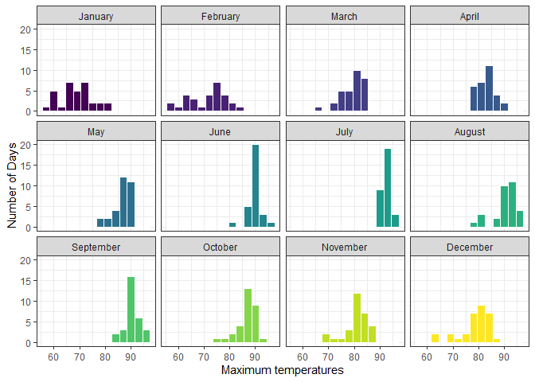
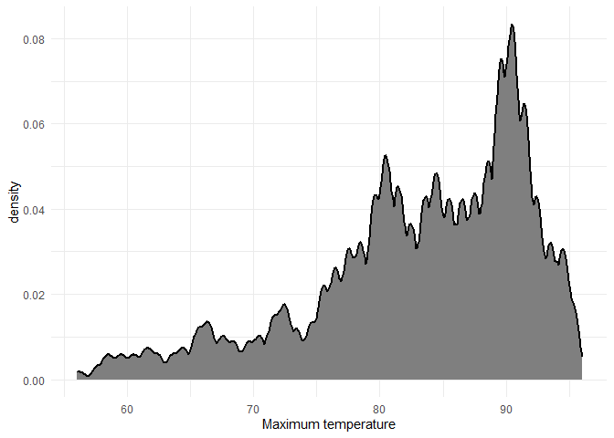
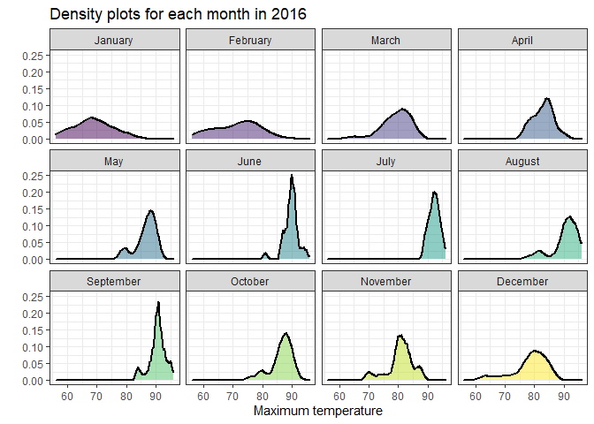
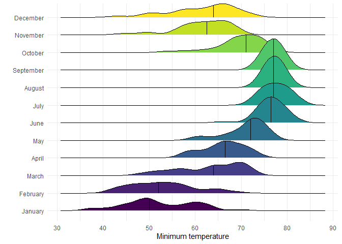
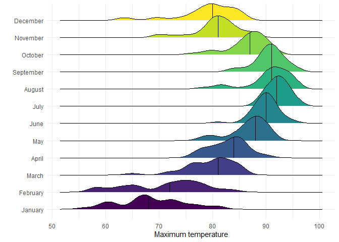
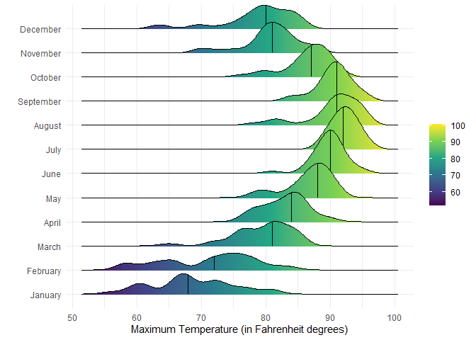

# Data Visualization Project 03


In this exercise you will explore methods to visualize text data and practice how to recreate charts that show the distributions of a continuous variable. 


# Density Plots

Using the dataset obtained from FSU's [Florida Climate Center](https://climatecenter.fsu.edu/climate-data-access-tools/downloadable-data), for a station at Tampa International Airport (TPA) from 2016 to 2017, attempt to recreate the charts shown below


```r
library(tidyverse)
library(viridis)
library(ggridges)
library(ggthemes)
weather_tpa <- read_csv("https://github.com/reisanar/datasets/raw/master/tpa_weather_16_17.csv")
# random sample 
sample_n(weather_tpa, 4)
```

```
## # A tibble: 4 x 6
##    year month   day precipitation max_temp min_temp
##   <dbl> <dbl> <dbl>         <dbl>    <dbl>    <dbl>
## 1  2016     6     1         0.02        91       77
## 2  2016     6     8         0.25        89       78
## 3  2016    12    23         0           82       60
## 4  2016     8    17         0.290       94       77
```

See https://www.reisanar.com/slides/relationships-models#10 for a reminder on how to use this dataset with the `lubridate` package for dates and times.


(a) Recreate the plot below:


Hint: the option `binwidth = 3` was used with the `geom_histogram()` function.

## Cleaning data

```r
months <- c("January","February","March", "April", "May","June", "July","August","September", "October","November","December")
weather_tpa <- weather_tpa %>%
  mutate(month = factor(
                      weather_tpa$month,
                      levels = c(1:12)
                    )) %>% 
  mutate(month_name = factor(
                            months[ weather_tpa$month ],
                            levels = months
                          )
         ) %>% 
  mutate(max_temp=as.double(max_temp),
         min_temp=as.double(min_temp), 
         precipitation=as.double(precipitation))%>%
           arrange(month)

head(weather_tpa)
```

```
## # A tibble: 6 x 7
##    year month   day precipitation max_temp min_temp month_name
##   <dbl> <fct> <dbl>         <dbl>    <dbl>    <dbl> <fct>     
## 1  2016 1         1          0          81       70 January   
## 2  2016 1         2          0          73       59 January   
## 3  2016 1         3          0.18       61       50 January   
## 4  2016 1         4          0          66       49 January   
## 5  2016 1         5          0          68       49 January   
## 6  2016 1         6          0          67       54 January
```

## Plotting the data


```r
weather_tpa %>% 
ggplot(mapping= aes(x = max_temp, fill = month_name)) +
  geom_histogram(binwidth = 3, color = "#FFFFFF") + 
  scale_fill_viridis_d() +
  theme_bw() +
  theme(legend.position = "none") +
  facet_wrap(~month_name) + 
  labs(x = "Maximum temperatures", y = "Number of Days")
```

<!-- -->


# (b) Recreate the plot below:


Hint: check the `kernel` parameter of the `geom_density()` function, and use `bw = 0.5`.


```r
weather_tpa %>% 
  ggplot(mapping=aes(x= max_temp)) + 
    geom_density_line(fill = '#7F7F7F', 
                 kernel = "epanechnikov", 
                 bw = .5,
                 alpha = 1,
                 size = 1) + 
    theme_minimal() + 
    labs(x = "Maximum temperature")
```

<!-- -->


# (c) Recreate the chart below:


Hint: default options for `geom_density()` were used. 


```r
weather_tpa %>% 
  ggplot(mapping=aes(x = max_temp, fill = month_name)) +
    geom_density(kernel = "triangular", size = 1) + 
    facet_wrap(~month_name) + 
    theme_bw() +
    scale_fill_viridis_d(alpha = .5) +
    theme(legend.position = "none") + 
    labs(x = "Maximum temperature", y = "", title = "Density plots for each month in 2016")
```

<!-- -->

# (d) Recreate the chart below:


Hint: default options for `geom_density()` were used. 


```r
weather_tpa %>% 
  ggplot(mapping = aes(x = min_temp, 
                  y = month_name, fill = month_name)) + 
    geom_density_ridges() +
    stat_density_ridges(quantile_lines = TRUE, quantiles = 0.5) + 
    scale_fill_viridis_d() +
    theme_minimal() +
    theme(legend.position = "None") + 
    labs(x = "Minimum temperature", y = "")
```

```
## Picking joint bandwidth of 2.07
## Picking joint bandwidth of 2.07
```

<!-- -->


# (e) Recreate the plot below:


Hint: use the`ggridges` package, and the `geom_density_ridges()` function paying close attention to the `quantile_lines` and `quantiles` parameters.


```r
weather_tpa %>% 
  ggplot(mapping = aes(x = max_temp, 
      y = month_name, fill = month_name)) + 
    geom_density_ridges(quantile_lines = TRUE, quantiles = 0.5) + 
    scale_fill_viridis_d() +
    theme_minimal() +
    theme(legend.position = "None") + 
    labs(x = "Maximum temperature", y = "")
```

```
## Picking joint bandwidth of 1.49
```

<!-- -->


(f) Recreate the chart below:


Hint: this uses the `plasma` option (color scale) for the _viridis_ palette.


```r
weather_tpa %>% 
  ggplot(aes(x = max_temp, 
             y = month_name, fill = stat(x))) + 
    stat_density_ridges(geom = "density_ridges_gradient",
                        quantile_lines = TRUE, quantiles = 0.5) +
    scale_fill_viridis_c(name = "") +
    theme_minimal() +
    labs(x = "Maximum Temperature (in Fahrenheit degrees)", y = "")
```

```
## Picking joint bandwidth of 1.49
```

<!-- -->

